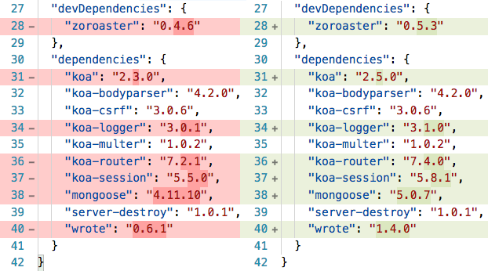

# yarn-up

`yarn-up` can be used to upgrade all dependencies to the latest versions. It will check if the version is exact, or with a tilda, and spawn `yarn upgrade -E` for exact versions, and `yarn upgrade` for non-fixed versions.

```
npm i -g yarn-up
yarn global add yarn-up
```

```sh
cd idio # your package
yarn-up
```

```fs
Offices-iMac:idio user$ yarn-up
yarn upgrade zoroaster@latest koa@latest koa-bodyparser@latest koa-csrf@latest koa-logger@latest koa-multer@latest koa-router@latest koa-session@latest mongoose@latest server-destroy@latest wrote@latest --exact
yarn upgrade v1.3.2
[1/5] 🔍  Validating package.json...
[2/5] 🔍  Resolving packages...
[3/5] 🚚  Fetching packages...
[4/5] 🔗  Linking dependencies...
[5/5] 📃  Rebuilding all packages...
success Saved lockfile.
success Saved 35 new dependencies.
├─ assert-diff@1.2.4
├─ assert-plus@1.0.0
├─ assert-throws@1.3.0
├─ bluebird@3.5.0
├─ cli-color@0.1.7
├─ difflib@0.2.4
├─ dreamopt@0.6.0
├─ erotic@0.2.0
├─ es5-ext@0.8.2
├─ fresh@0.5.2
├─ heap@0.2.6
├─ json-diff@0.5.2
├─ kareem@2.0.5
├─ koa-bodyparser@4.2.0
├─ koa-csrf@3.0.6
├─ koa-logger@3.1.0
├─ koa-multer@1.0.2
├─ koa-router@7.4.0
├─ koa-session@5.8.1
├─ koa@2.5.0
├─ lodash.get@4.4.2
├─ makepromise@1.1.1
├─ mongodb-core@3.0.2
├─ mongodb@3.0.2
├─ mongoose-legacy-pluralize@1.0.2
├─ mongoose@5.0.7
├─ mquery@3.0.0
├─ pedding@1.1.0
├─ require_optional@1.0.1
├─ restream@1.2.0
├─ server-destroy@1.0.1
├─ urijs@1.19.1
├─ wordwrap@1.0.0
├─ wrote@1.4.0
└─ zoroaster@0.5.3
warning "zoroaster" is already in "devDependencies". Please remove existing entry first before adding it to "dependencies".
✨  Done in 5.61s.
```

## git diff



## Arguments

<table>
 <thead>
  <tr>
   <th>Argument</th> 
   <th>Short</th>
   <th>Description</th>
  </tr>
 </thead>
  <tr>
   <td>--exclude</td>
   <td>-e</td>
   <td>Comma-separated packages to exclude.</td>
  </tr>
  <tr>
   <td>--upgrade</td>
   <td>-u</td>
   <td>Run <code>yarn upgrade</code> after the update.</td>
  </tr>
  <tr>
   <td>--help</td>
   <td>-h</td>
   <td>Display usage information.</td>
  </tr>
  <tr>
   <td>--version</td>
   <td>-v</td>
   <td>Show version number.</td>
  </tr>
</table>

## Copyright

(c) [Art Deco][1] 2019

[1]: https://artd.eco